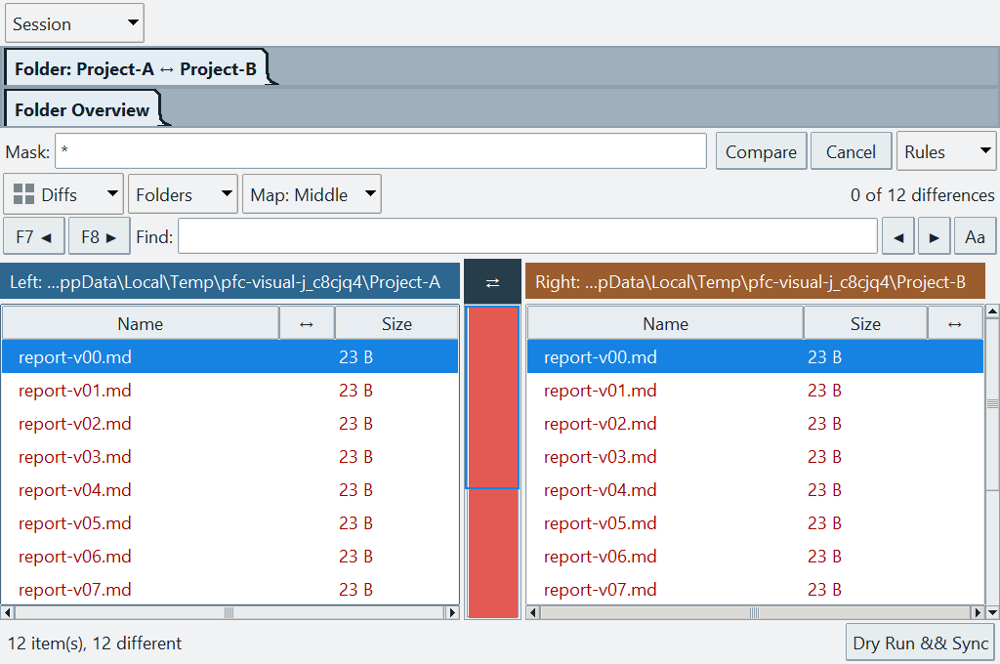

# Compact workflows — v0.17.28

This adds useful reading/comparison/navigation tools, not an IDE, vault service,
plugin host or automatic synchronization engine. Everything persists locally in
`pfc.ini`; no index, telemetry, account or network connection is added.

## Where to find the eight additions

| Feature | Entry point | Behavior and limits |
| --- | --- | --- |
| Lossless text editing | F9 → Text Compare → Edit Left / Edit Right | Original source, not alignment padding. Preserves UTF-8/16/32 BOM, LF/CRLF/CR and final newline. Invalid/unknown encoding and mixed EOL remain read-only. Conflict-checked same-directory replacement; Windows uses ReplaceFileW to preserve ACLs/streams. |
| Named comparison sessions | Tools → Saved comparisons; Compare → Session | Saves logical left/right sources, selected base, masks, excludes, recursion, content/text-equivalence rules and result filter. Reopens a new comparison, never a copy plan. Unavailable sources produce an explanation. |
| Command search | Ctrl+Shift+P; Tools | Search common commands and every Settings label/category, including English and Chinese terms. Enter runs; Esc closes. No file search or indexing. |
| Markdown bookmarks and reading position | F3 rendered Markdown → Reading | Named document/section positions and the last 40 reading positions. Unchanged documents restore the viewport; changed documents restore a uniquely named section, otherwise the top. No fuzzy search. Bookmarks obey the bounded local-link worker and cloud/reparse restrictions. Archive bookmarks are disabled. |
| Exclusion rules | Folder Compare → Rules → Exclusions | Semicolon-separated names/globs or paths relative to selected roots. Bare names match at any depth. Defaults: `.git;.svn;node_modules;.venv;__pycache__`; `.git/.svn` always excluded. Press Compare after changing rules. |
| Comparison reports | Compare → Session → Export report | HTML or plain text: statuses, summary and the exact completed scan rules. Relative paths only, no file contents or absolute source roots. HTML escapes names and blocks active content. It cannot replace a compared source file. |
| Inline differences | Text Compare | Changed character spans within changed lines. Long lines skip fine highlighting; there is no animation/polling to recalculate these tags. |
| Named workspaces | Tools → Workspaces; tab/blank-panel context menu | Saves all four groups, selected tabs, 1–4 panel layout, shared order, tree ratio, colors, locks, filters and tab display/sort options. Validates every saved path first. Switching asks once and saves a reversible Before switching snapshot. Files and global preferences are untouched. |

Named lists hold up to 40 entries, with 80-character names. Workspaces are bounded
to 80 tabs. Overwrite and removal of metadata require explicit confirmation.
The separate **Restore previous workspace** command is reversible: switching back
also retains the workspace being left. Missing folders never silently fall back to
a different path or a partially reconstructed workspace.

## Safety and responsiveness

- Text Compare loads at most 2 MiB and 20,000 lines per side. Above 4,000 lines it
  explicitly labels positional comparison instead of running costly line alignment.
  Inline character matching is limited to 2,000 characters per line and 100,000
  characters per render. These are bounded approximations, not claimed optimal diffs.
- Binary previews read at most 256 KiB per side and clearly distinguish a preview
  from a full-file equality check. Folder By content uses streamed SHA-256 off Tk.
- Aligned views are read-only. The original text editor has Undo, Ctrl+S and an
  unsaved-change prompt. External refresh pauses while an editor is open; a changed
  disk fingerprint refuses overwrite while retaining the draft. Hard links and
  symbolic links are not rewritten by the editor.
- Folder scans are capped at 100,000 entries per side and report access failures.
  Links, junctions, special files and cloud/recall entries are not followed as data;
  their result is Unknown, not falsely Identical. A scan must finish under the
  current rules before export or sync.
- A selected folder expands into **individually scanned ordinary files**, never
  a recursive copy. Excluded/new/unreviewed children cannot sneak into the plan.
  A child Skip overrides its parent's direction. Empty folders are not created by
  this file-only plan; use normal folder operations when that is needed.
- Compare copying runs in a worker, with conflict questions on Tk's thread and
  visible per-file progress. Cancel stops after the current file (not mid-file).
  Source/target link changes are refused. There is still no automatic delete or
  bidirectional conflict resolution.
- Report export refuses compared sources through canonical paths or linked
  destinations, and stages a complete new report before replacement. A failed
  write leaves the previous report intact.

## UI / UX decisions

Offline Windows capture at 150%, using synthetic Project-A/Project-B files.
**Rules** contains exclusions/content options; **Session** contains saved
comparisons and report export. Long headers retain the current folder name.

- No new permanent main toolbar. Commands/workspaces live in Tools and their
  relevant context menus; comparison/session and reading actions stay in those windows.
- Pickers use fixed footers and flexible result lists; bounded pixel fonts prevent
  application zoom from hiding their controls. Tab/Shift+Tab, arrows, Enter and Esc
  work inside the dialog without sending actions to the background file panel.
- Main menu text is 90% of file-list size; version/clipboard are 80%, with a readable
  minimum. Column headings are 90% bold. Active tab titles are bold while width is
  reserved for either weight, so switching does not shift adjacent tabs.
- Compare rules and folder actions use nearby menus. Previous/next and find are
  compact, with hover explanations. The difference map no longer reserves a wide
  central menu column. Narrow comparisons show Size without timestamp; widening
  restores metadata without rebuilding rows, resetting selection or moving scroll.
- Comparison control/tab fonts are capped at 24 pixels under extreme zoom, while
  file/document text keeps the requested zoom. Long source headers retain their
  distinguishable path suffix and show the complete path on hover. Setting a copy
  direction updates the existing rows instead of flashing a reconstructed list.

## Deliberately not enabled

Live OneDrive transition acceptance still needs a separately authorized, signed-in
online Windows installation. Resident cloud-link support remains restricted until
its no-recall behavior is validated. Whole-drive/vault indexing, basename guessing,
backlink graphs, executable Markdown/Dataview, community plugins, automatic merge,
and sync deletion remain outside this batch.

See the [three-round validation record](workflow-validation-2026-09-22.md).
