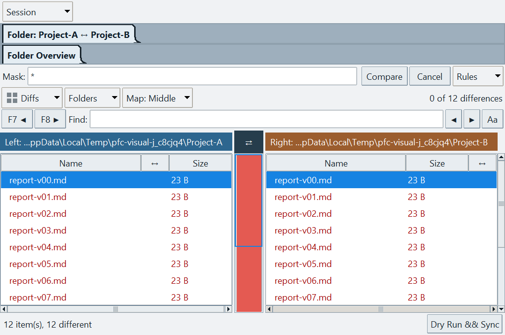

# Compact workflows — v0.17.28

This adds useful reading/comparison/navigation tools, not an IDE, vault service,
plugin host or automatic synchronization engine. Everything persists locally in
`pfc.ini`; no index, telemetry, account or network connection is added.

## Where to find the eight additions

| Feature | Entry point | Behavior and limits |
| --- | --- | --- |
| Lossless text editing | F9 → Text Compare → Edit Left / Edit Right | Original source, not alignment padding. Preserves UTF-8/16/32 BOM, LF/CRLF/CR and final newline. Invalid/unknown encoding and mixed EOL remain read-only. Conflict-checked same-directory replacement; Windows uses ReplaceFileW to preserve ACLs/streams. |
| Named comparison sessions | Tools → Saved comparisons; Compare → Session | Saves logical left/right sources, selected base, masks, excludes, recursion, content/text-equivalence rules and result filter. Reopens a new comparison, never a copy plan. Unavailable sources produce an explanation. |
| Command search | Ctrl+Shift+P; Tools | Search common commands and every Settings label/category, including English and Chinese terms. Enter runs; Esc closes. No file search or indexing. |
| Markdown bookmarks and reading position | F3 rendered Markdown → Reading | Named document/section positions and the last 40 reading positions. Unchanged documents restore the viewport; changed documents restore a uniquely named section, otherwise the top. No fuzzy search. Bookmarks obey the bounded local-link worker and cloud/reparse restrictions. Archive bookmarks are disabled. |
| Exclusion rules | Folder Compare → Rules → Exclusions | Semicolon-separated names/globs or paths relative to selected roots. Bare names match at any depth. Defaults: `.git;.svn;node_modules;.venv;__pycache__`; `.git/.svn` always excluded. Press Compare after changing rules. |
| Comparison reports | Compare → Session → Export report | HTML or plain text: statuses, summary and the exact completed scan rules. Relative paths only, no file contents or absolute source roots. HTML escapes names and blocks active content. It cannot replace a compared source file. |
| Inline differences | Text Compare | Changed character spans within changed lines. Long lines skip fine highlighting; there is no animation/polling to recalculate these tags. |
| Named workspaces | Tools → Workspaces; tab/blank-panel context menu | Saves all four groups, selected tabs, 1–4 panel layout, shared order, tree ratio, colors, locks, filters and tab display/sort options. Validates every saved path first. Switching asks once and saves a reversible Before switching snapshot. Files and global preferences are untouched. |

Named lists hold up to 40 entries, with 80-character names. Workspaces are bounded
to 80 tabs. Overwrite and removal of metadata require explicit confirmation.
The separate **Restore previous workspace** command is reversible: switching back
also retains the workspace being left. Missing folders never silently fall back to
a different path or a partially reconstructed workspace.

## Safety and responsiveness

- Small-file Text Compare loads at most 2 MiB; larger files, over 4,000 lines or
  lines over 4,096 bytes automatically use the 20 MiB Review implementation below.
  Inline character matching is limited to 2,000 characters per line and 100,000
  characters per render. These are bounded approximations, not claimed optimal diffs.
- Binary previews read at most 256 KiB per side and clearly distinguish a preview
  from a full-file equality check. Folder By content uses streamed SHA-256 off Tk.
- Aligned views are read-only. The original text editor has Undo, Ctrl+S and an
  unsaved-change prompt. External refresh pauses while an editor is open; a changed
  disk fingerprint refuses overwrite while retaining the draft. Hard links and
  symbolic links are not rewritten by the editor.
- Folder scans are capped at 100,000 entries per side and report access failures.
  Links, junctions, special files and cloud/recall entries are not followed as data;
  their result is Unknown, not falsely Identical. A scan must finish under the
  current rules before export or sync.
- A selected folder expands into **individually scanned ordinary files**, never
  a recursive copy. Excluded/new/unreviewed children cannot sneak into the plan.
  A child Skip overrides its parent's direction. Empty folders are not created by
  this file-only plan; use normal folder operations when that is needed.
- Compare copying runs in a worker, with conflict questions on Tk's thread and
  visible per-file progress. Cancel stops after the current file (not mid-file).
  Source/target link changes are refused. There is still no automatic delete or
  bidirectional conflict resolution.
- Report export refuses compared sources through canonical paths or linked
  destinations, and stages a complete new report before replacement. A failed
  write leaves the previous report intact.

## UI / UX decisions

Offline Windows capture at 150%, using synthetic Project-A/Project-B files.
**Rules** contains exclusions/content options; **Session** contains saved
comparisons and report export. Long headers retain the current folder name.

- No new permanent main toolbar. Commands/workspaces live in Tools and their
  relevant context menus; comparison/session and reading actions stay in those windows.
- Pickers use fixed footers and flexible result lists; bounded pixel fonts prevent
  application zoom from hiding their controls. Tab/Shift+Tab, arrows, Enter and Esc
  work inside the dialog without sending actions to the background file panel.
- Main menu text is 90% of file-list size; version/clipboard are 80%, with a readable
  minimum. Column headings are 90% bold. Active tab titles are bold while width is
  reserved for either weight, so switching does not shift adjacent tabs.
- Compare rules and folder actions use nearby menus. Previous/next and find are
  compact, with hover explanations. The difference map no longer reserves a wide
  central menu column. Narrow comparisons show Size without timestamp; widening
  restores metadata without rebuilding rows, resetting selection or moving scroll.
- Comparison control/tab fonts are capped at 24 pixels under extreme zoom, while
  file/document text keeps the requested zoom. Long source headers retain their
  distinguishable path suffix and show the complete path on hover. Setting a copy
  direction updates the existing rows instead of flashing a reconstructed list.

## Deliberately not enabled

Live OneDrive transition acceptance still needs a separately authorized, signed-in
online Windows installation. Resident cloud-link support remains restricted until
its no-recall behavior is validated. Whole-drive/vault indexing, basename guessing,
backlink graphs, executable Markdown/Dataview, community plugins, automatic merge,
and sync deletion remain outside this batch.

See the [three-round validation record](workflow-validation-2026-09-22.md).

## Comparison review — v0.18.15

### Text and Markdown

F9 opens large/wide text in **Review**. On a small text comparison use
**Review & Edit**. F7/F8 jump between difference blocks; arrows copy the current
block into the opposite **draft**, not the original file. The checkmark records
review status, not acceptance or saving. Actions groups editing, undo/redo,
Save Left/Right, Save As, review JSON, report export and explicit disk reload.
An external file change refuses overwrite and retains the draft. Reload asks
before discarding an unsaved draft. Review markers are bound to both contents.
Compare → Navigate lists its shortcuts: **F3** next search result,
**Shift+F3** previous, **Ctrl+F** search, **F7/F8** previous/next difference.
These keys route to the active comparison (including nested archive members),
not the main Commander's Preview or VCS actions. Enter/Shift+Enter also search
from the Find field. The readonly cell grid selects matching cells, not pages.

- 20 MiB per source and encoded saved file. UTF BOM, encoding, original EOL and
  final-newline behavior are preserved. Mixed EOL, unknown encoding and linked
  sources remain readonly. No three-way or automatic merge.
- Alignment runs in a cancellable process, 90-second timeout, 2 GiB memory ceiling.
  Unique-line anchors plus bounded fine alignment avoid a positional fallback;
  large ambiguous spans remain explicit replacement blocks, not an optimality claim.
- Only 80 aligned rows and 2,048 characters per row enter Tk at once. Horizontal
  scrolling reveals the full source width; difference navigation reveals the
  first changed character, even in a million-character line. The source editor
  pages through 32,000-character segments. These are viewing/editing pages, not
  source truncation. Narrow windows stack the two sides without reducing fonts.
- View → Markdown reading preview follows the active source side and location.
  It is a readonly excerpt (up to 64,000 characters), not a full-document semantic
  or rendered diff. A construct crossing the excerpt boundary may be incomplete.
  Source comparison remains authoritative; no links, plugins or scripts execute.
- HTML/text exports default to addresses and review status; content inclusion
  requires a separate choice. Review JSON stores digests/marks, not source text.

### Excel and tabular data

`.xlsx` and `.xlsm` open a paged **cell comparison grid**, not an Excel editor.
Choose a worksheet, then Rules → Values / Formulas / Both. Hidden sheets remain
selectable. Double-click a cell row for its full value/formula. Row key columns
align reordered records; missing/duplicate keys are refused rather than guessed.
CSV/TSV use the same UI with their existing 2 MiB input limit.

Stored formula results are read as saved; PFC does **not recalculate**, execute
macros or follow external relationships. Missing cached results are labeled.
Dates use the workbook's date system. Styles, charts, conditional formatting,
macro contents, legacy `.xls`, encrypted books and writing Excel are outside this
version. Limits: one million populated cells and 256 MiB of workbook XML.
Reports cover the selected sheet and current filter; content inclusion is opt-in.

Since v0.18.16 the default is all loaded cells, with **Differences only** beside
Find. The footer states the compared cell count, difference count and available
worksheet count; these are for the currently selected sheet/rules, not proof that
the entire workbook is identical. Empty results explain the reason and offer
Show all cells when filters hide data. Strict and Transitional OOXML are supported;
unsupported XML formats produce an explicit error. Missing cached formula results
remain unknown, not recalculated values. The reporter's original workbook pair
was not supplied, so its precise cause is not asserted from a photograph alone.

### Independent folder/archive pairing — v0.18.16

Select one real file in each pane, even with different names, then choose
**Compare selected files** from either pane's context menu or the compact toolbar.
The same action is labeled **Pair files** in narrow windows. Selection is independent;
scrolling and corresponding rows remain aligned. Copy arrows still target the
same relative-path row, not the manually paired file: pairing only opens a comparison.

Right-click a folder → **Set Base Folder · Left/Right** changes only that side.
Right-click the path header → **Up one level** or **Reset Base Folder** restores
the side within its original source. Archive bases cannot escape the staging root.
Nested tabs retain both original logical source paths. Swapping sides closes
confirmed nested drafts and updates archive ownership; explicit archive review
remains required for write-back. 7z listing accepts directory flags and attributes.

Neutral content, pale changed-line backgrounds and stronger changed-character
backgrounds keep the text readable. Purple identifies one-sided content; grey
identifies a missing counterpart. The current difference is underlined instead
of painted as a text selection. Yellow is search, blue is manual selection.
**Navigate → Comparison color legend** provides a textual guide.

### ZIP and 7z

Archive comparison extracts into private temporary drafts in a background worker.
By content starts enabled. Open members for nested comparison/editing, or use
the existing confirmed copy plan between sides. Archive deletions require an
explicit Draft actions command and can be undone before write-back.

**Review archive changes…** lists adds, replacements and deletions. Save one
archive at a time: revalidate the approved draft, rebuild beside the original,
extract/verify the rebuilt contents, recheck the original's fingerprint, create
a `.pfc-backup-…` sibling and atomically replace. Failure/cancellation before the
replacement leaves the original intact. Backups are retained for manual recovery;
recompression may change metadata/compression details and is not byte preservation.
Local-folder counterparts still use normal confirmed file sync, not archive drafts.

ZIP needs no extra program; 7z needs an installed/configured **7-Zip** executable.
The safety budget is 100,000 members / 2 GiB expanded data, with free-space checks.
This version stages the entire archive, not lazy individual-member extraction.
Encrypted, linked, traversal, duplicate/case-colliding and ambiguous Windows names
are refused. Archive source writes are never automatic; there is no recursive
nested-archive write-back, password support or distributed transaction across sides.

### v0.18.16 candidate validation

Synthetic source/portable checks cover Strict Excel strings/formulas/merged
cells, visible all-cell defaults and filter recovery, independent mouse/context
menu pairing for folders/ZIP/7z, per-side base changes and reset, archive swap
ownership and undo, and light/dark highlighting with text contrast of at least
4.5:1. Linux Tk screenshots were inspected; these are not Windows acceptance.

Native acceptance was initially blocked: VM1 was reserved for an unrelated recovery
diagnosis. A separately leased VM2 passed QGA ping, but its process-launch probe
fails with `Failed to execute helper program (Invalid argument)`. The test
Python executable exists; the two expected QGA helper executables could not be
opened. No PFC test was staged or launched through this failed readiness gate.
Leases were released and networking remained disabled. The operator subsequently
retired VM2 on 2026-10-03 instead of authorizing its repair. Native validation must
use VM1; do not recreate VM2. VM1 was subsequently recovered by separate host
maintenance. These are historical failures, not the final acceptance result below.

The full source/portable run completed 89 checks in 743.10 seconds with two
isolated workers: 87 passed, and both existing folder-leaf Right-key expansion
checks timed out. An attempted focus-wait change did not resolve this and was
removed. The earlier four-worker run had 88 passes and one occurrence of the
same timeout. These failures remain recorded, not silently converted to passes.
The 312-test unit suite completed with 304 passes and 8 platform skips.
Archive review keyboard isolation was subsequently narrowed so Tab traversal and
Escape cancellation work; this change is covered by the final focused Compare
source/portable rerun. No comparable whole-task baseline is available and token
usage is unknown; different worker counts are not an optimization comparison.
That final focused run passed all 7 checks in 95.48 seconds (source Compare
26.91 seconds, portable Compare 30.02 seconds), including real Tab, Escape and
F3/F8 isolation events. Candidate portable SHA-256:
`20e0c69d60101df79710922812203c04c41e25dee453cdbb297a6248f340128b`.

Follow-up validation on 2026-10-04 uses maintenance run
`4c6e485ac3784104bf7c6538cc25c7ec`. The folder-leaf failure was reproduced with a
Tk negative image-copy destination during transient font/row-height changes;
clipping icon and badge drawing to the current row avoids aborting the scan
poller. Five consecutive source runs and five portable runs passed. Auto zoom's
native fixed-pixel inset is no longer multiplied by the previous scale ratio;
source and portable compact-chrome tests passed. Windows return-to-folder
consistency subsequently passed without weakening the assertion.

The first follow-up full suite executed all 89 checks successfully in 381.02 s,
but correctly failed its source-stability gate because the Windows harness was
being repaired concurrently. This is not acceptance of one frozen final build.
The Windows attempts and their failures remain in the trace. QGA channel
timeouts and native comparison-test timeouts initially prevented acceptance;
an unlocked console also produced a black display capture.
The harness now checks display wake readiness, correlates and
synchronizes QGA requests, and keeps bounded execution-channel staging/reads and
private diagnostic logs. Native popup tests dismiss only their own UI thread's
modal menu rather than waiting for a statement that cannot execute until the
menu returns. A separate real Python 3.13 compatibility bug was fixed: inherited
Tkinter `Widget.busy` is callable, not PFC's boolean worker flag, and must not
prevent archive review after opening a small text member.

An intermediate portable passed all three Windows checks (Compare 41.201 s,
compact chrome 48.027 s, folder leaf 3.416 s), and a frozen 89-check full suite
also passed. Visual inspection nevertheless rejected those screenshots: earlier
failed test children had survived scheduled-task termination and obscured the
new window with a menu; enlarged workbook fonts also exceeded the default row
height. The old request-specific test processes were verified and closed, with
no user files removed. The runner now verifies cleanup of exact request-bound
test commands, not all Python processes. Workbook rows use measured font height
plus padding, with a geometry regression assertion. The final build is tested
again; earlier screenshots/results are retained as historical evidence rather
than silently relabeled as final acceptance.

The corrected frozen build passed all **89 source/portable checks in 380.07 s**,
including the 318-test unit suite (310 passed, 8 platform skips). The same
portable bytes passed Windows 11 ARM64 / Python 3.13.15: comparison 42.647 s,
compact chrome 47.911 s and folder leaf 3.433 s. Total leased runner time was
170.89 s including staging, evidence transfer and verified cleanup. SHA-256:
`d2ed8a3989eba10fdc0f3dc94540469d6d1e961d2b62c78278164a98dc9934fb`.

Visual/task self-review, not independent user acceptance:

- Light/dark text shows readable changed characters on a softer line highlight;
  the current difference uses an underline rather than painting all text selected.
  The opposite-side blank is grey and the one-sided text purple.
- Folder/ZIP panes retain two independently selected different filenames and
  explicitly labeled left/right base paths. Pairing opens a named nested tab;
  it does not retarget a copy action.
- At 175% the worksheet rows now fully contain their enlarged text. Long cell
  values remain horizontally clipped by their columns; double-click exposes the
  full value. The visible filter and explicit empty-state recovery prevent an
  equal/filtered worksheet from resembling an unreadable workbook.
- Archive review names the changed member and archive side, with visible Save
  and Cancel controls. Tab/Escape and comparison shortcut isolation pass.
- Retaken screenshots have no stale popup obstruction. Evidence is private under
  the run's `windows-evidence/ca0b0532bf0d4d4b8ea9e50654064007` directory.

The rebuilt Windows guest initially lacked 7-Zip; that optional branch was not
counted as native 7z acceptance. 7-Zip 26.03 ARM64 was subsequently downloaded
from the [official download page](https://www.7-zip.org/download.html) on the host,
matched to the official release asset's SHA-256
`e22ce71c11dcf503c448fe51e56f41830eb4e1344fa5c7731ae63bce533a8e8e`, staged and
installed offline under the VM1 lease. The unchanged final portable then passed
Compare again in **45.456 s**, with `seven_zip_available: true`, including actual
7z base selection, independent file pairing and verified archive rewrite.
Request `b12174e390e243cb829567b6d172346d` retains the native 7z screenshot and log;
its two selected files and per-side archive/base labels were visually reviewed.
Guest networking stayed off, cleanup passed and all leases were released.

No comparable whole-task baseline is available. Official token counters are
unavailable, so token usage and token savings remain unknown. These timings are
not a claimed improvement over differently scoped runs or failed readiness checks.

### v0.18.15 evidence and remaining limits

An official reference comparison application was installed in the leased Windows VM solely for
synthetic-data evaluation. Large Markdown, Excel sheet comparison and ZIP/7z
member edit/save workflows were observed; PFC has no dependency on that application.
Official 7-Zip ARM64 was installed for native 7z write-back tests. VM networking
remained disabled; verified installers were staged through the leased channel.

Windows 11 ARM64 portable tests exercised draft/cancel/save/conflict behavior,
million-character lines, one million lines, sheets/formulas and archive backup
write-back. The final candidate run loaded/aligned the ~20 MiB fixture in
1.631 seconds and the million-line fixture in 4.679 seconds. These are synthetic
observations, not performance guarantees or a cross-product benchmark.
Native screenshots covered text at 175%/760 px, the cell grid and archive review;
automated geometry checks cover 100/150/175/200%. QGA retries remain recorded.
The final native Compare check passed in 27.33 seconds. Its portable SHA-256 is
`93775ee71b62edfc64a4dc988aa982a036e237cd86f6d00fb9328fc179ff1ab0`.
Full source/portable regression took 376.42 seconds: 88 of 89 checks passed.
The existing folder-leaf expansion timeout passed a 3.08-second standalone retry;
this does not establish that intermittent issue is fixed. The 306-test unit suite
completed with 298 passes and 8 platform skips. A separate native Auto Font Size return-to-folder
check failed (250% versus 225%) and remains explicitly listed in TODO.
There is no comparable full-task baseline; token usage is unknown.
